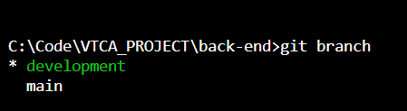
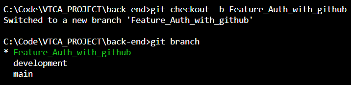
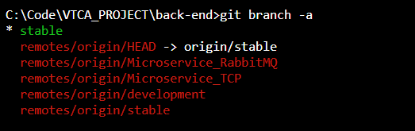
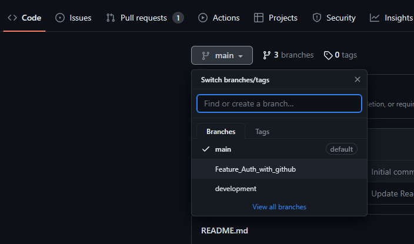
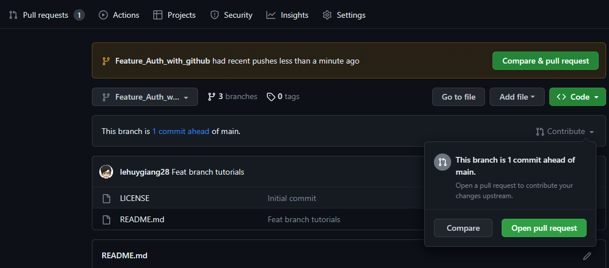
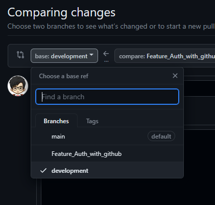
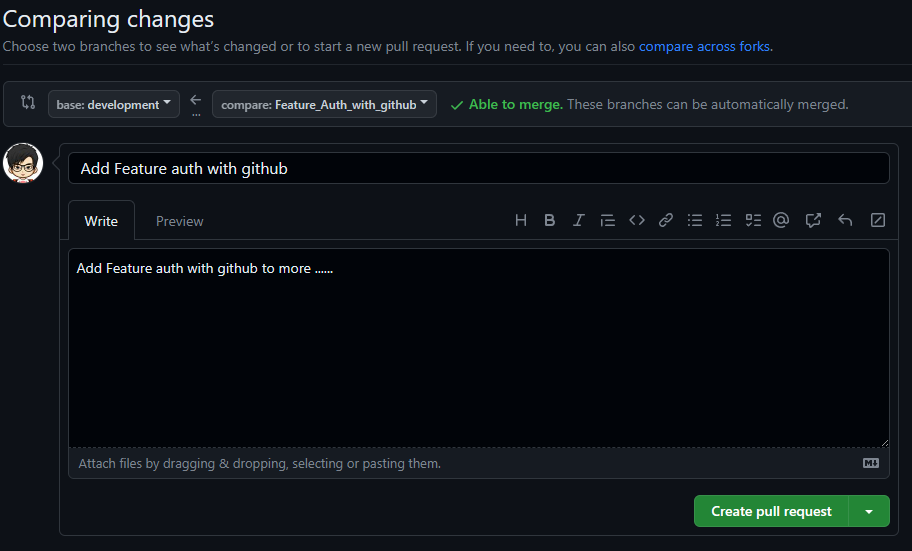

# Github documentations for project

Step to step to work with git 🔥:

## 🚀 Lưu ý:

- Không làm việc tại các branch main, stable, development. Hãy tạo branch mới, làm việc tại đó.
- Cách đặt tên cho branch mới:
  - Theo định dạng `<type>_<name>`.
  - Với type là:
    - Feature: Chức năng mới.
    - Fix: Sửa lỗi.
    - Refactor: Sửa lại định dạng, tổ chức lại code.
    - Test: Kiểm, thử ...
    - ...
  - Và `name` là mô tả ngắn gọn cho mục tiêu
  - (Ví dụ: `Feature_Auth_with_github` để thêm chức năng đăng nhập với github)
- Thường xuyên [git pull](#1-lấy-code-từ-github) để cập nhât phiên bản mới nhất của code trên github. Đặc biệt trước mỗi khi làm việc và push code hãy chạy [git pull](#1-lấy-code-từ-github)
- Xử lí [xung đột (conflict)](https://viblo.asia/p/lam-the-nao-de-han-che-conflict-khi-lam-viec-voi-git-djeZ1m8oZWz) sớm nhất có thể khi phát hiện

## 🚀 Step to works:

- Nếu **chưa** có repo, [clone repo](#1-lấy-code-từ-github) từ github
- [Đã có repo, xác định điều cần làm (feature, fix, ...)](#🚀-lưu-ý)
- **Không** sử dụng các branch `main`, `stable`, `development` để chỉnh sửa, hãy [tạo branch mới](#2-làm-việc-với-branch) và làm việc trên branch mới đó
- Kiểm thử
- [Commit](#3-commit) khi hoàn thành, và [push](#4-push) lên github
- Tạo **[Pull Request](#5-tạo-pull-request)** và nhờ người khác review code, đánh giá, kiểm thử.
- Chỉ tạo **[Pull Request](#5-tạo-pull-request)** để merge vào branch `development` hoặc branch khác mà không phải branch `main`, `stable`

# 🔥 Bắt đầu nhanh

### **1. Lấy code từ github:**

- Trường họp chưa có code trên máy:
  - Clone git repository về máy bằng câu lệnh:
  ```bash
  git clone <link-to-repo>
  ```
  - Có thể đặt lại tên bằng cách thêm tên phía sau:
  ```bash
  git clone <link-to-repo> <name>
  ```
- Đã có code trên máy:
  - Lấy code mới nhất trên github về:
  ```bash
  git pull
  ```

### **2. Làm việc với branch:**

- Kiểm tra branch:

```bash
git branch
```

  <p align="center"></p>

- Kiểm tra tất cả các branch:
```bash
git branch --all
```

- Tạo branch mới:
```bash
git branch <new_branch_name>
```

- Chuyển sang branch đã tồn tại:

```bash
git checkout <branch_name>
```

- Chuyển sang branch chưa tồn tại, và tự động tạo mới:
```bash
git checkout -b <new_branch_name>
```

  <p align="center">
    
  </p>
- Để xóa branch, cần phải checkout sang branch khác branch cần xóa sau đó:

```bash
# nếu branch đã merge vào branch nào đấy rồi
git branch -d <branch_name_to_remove>

# nếu branch chưa từng merge vào branch nào
git branch -D <branch_name_to_remove>
```
- Lần đầu clone code có thể sẽ thiếu các branch phụ, mà chỉ có branch chính, như sau:
  <p align="center">
    
  </p>

- Cách xử lí, ví dụ muốn vào branch tên là `development`:
```bash
git switch <branch_to_switch>

# ví dụ
git switch development
```

### **3. Commit:**

- Để thêm các file muốn commit vào staged area. Bạn cũng có thể sử dụng git add . để thêm tất cả các thay đổi trong repository.

```bash
  git add <path-to-file>
  #or
  git add .
```

- Để kiểm tra trạng thái của staged area và các file trong working directory, sử dụng:

```bash
git status
```

- Để xem sự khác biệt giữa các file trong working directory và staged area, sử dụng:

```bash
git diff
```

- Khi đã staged các file, để commit các file (Lưu ý rằng commit message cần phải rõ ràng và mô tả đầy đủ các thay đổi trong commit), sử dụng:

```bash
git commit -m "<commit_message>"
```

- Nếu cần chỉnh sửa lại commit, sử dụng:

```bash
git commit --amend
```

- Để xem lại lịch sử commit của repository, sử dụng:

```bash
git log
```

### **4. Push:**

- Sau khi đã commit các thay đổi, bạn có thể đẩy chúng lên repository trên server bằng lệnh:

```bash
git push
```

- Lưu ý rằng trước khi push, bạn cần phải pull dữ liệu mới nhất từ server về bằng lệnh:

```bash
git pull
```

- Để đẩy các thay đổi lên branch hiện tại, sử dụng lệnh:

```bash
git push origin <branch_name>
```

- Nếu branch chưa được đẩy lên server trước đó, để đẩy branch và thiết lập upstream cho lần đẩy tiếp theo bạn có thể sử dụng lệnh:

```bash
git push --set-upstream origin <branch_name>
```

### **5. Tạo pull request:**

- Sau khi push thành công, truy cập vào repo trên github:
<p align="center">
  </p>
- Branch mới đã được push lên thành công, bấm vào branch vừa push, và chọn `Open Pull Request`:
<p align="center">
  </p>
- Chuyển sang `development`, không được merge vào `main` trừ khi là hot fix:
<p align="center">
  </p>
- Điền tiltle và comment để mô tả mục đích của branch muốn merger, sau đó chọn `Create Pull Request`:
<p align="center">
  </p>

### **6. Theo dõi Pull Request:**

- Nhớ theo dõi Pull Request để thảo luận về code của bạn ... 🔥
